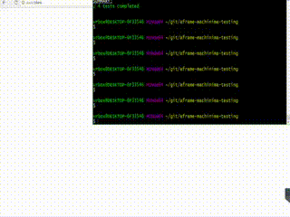

# aframe-machinima-testing

[](https://www.npmjs.com/package/aframe-machinima-testing)

Utilities for automated functional testing in A-Frame scenes and components
using motion-captured user input.



This project is dedicated to the memory of Hugh Hancock, coiner of the
term "machinima" and pioneer VR game developer.


## Installation

Install from npm into your package:

```bash
npm install --save-dev aframe-machinima-testing
```

There is a long list of peer dependencies including
[aframe-motion-capture-components](https://github.com/dmarcos/aframe-motion-capture-components)
and all the pieces for Karma-Mocha-Chai testing. The install command below
will get you up to speed with compatible versions of each.

```bash
npm install --save-dev  aframe-motion-capture-components@git+https://git@github.com/wmurphyrd/aframe-motion-capture-components.git#v0.2.8a chai@^4.1.2 karma@^1.7.1 karma-browserify@^5.1.1 karma-chrome-launcher@^2.2.0 karma-firefox-launcher@^1.0.1 karma-html2js-preprocessor@^1.1.0 karma-mocha@^1.3.0 karma-mocha-reporter@2.1.0 karma-sinon-chai@^1.3.2 mocha@^3.5.3 sinon@^2.1.0 sinon-chai@^2.13.0
```

Note: temporarily linking to a fork of the motion capture components until a patch
lands in the next release.

## Usage: Workflow

Machinima tests can be run just like other automated tests.
They will replay recorded user actions in an A-Frame scene
and allow you to check assertions
against the resulting scene state. Running machinima tests requires some
package structure, Karma configuration, and specific calls in your Mocha tests.

This package includes the `machinima-bootstrap` command line tool to setup
the  necessary package structure and `karma.config.js` and also exports helper
functions to streamline the process of writing Mocha tests.

Once setup, the workflow is:

1. Add HTML A-Frame scenes to `machinima_tests/scenes`
2. Use the `npm run record:machinima` command to load the scenes and
   record motion-captured user actions
3. Save the recordings in recordings in `machinima_tests/recordings`
3. Create tests in `machinima_tests/tests` that replay the recordings in the
   scenes and run assertions on the resulting state
5. Use the `npm run test:machinima` command to run the tests

## Usage: machinima-bootstrap CLI

The package includes a CLI to add the necessary configuration for automated
functional testing in your NodeJS package. You can call it from the local
installation with the commend below:

```bash
node_modules/.bin/machinima-bootstrap
```

This will install a set of templates in `./machinima_tests` and you will
be ready to run the example tests with:

```bash
npm run test:machinima
```

Load up your scenes to make new recordings with the following command:

```bash
npm run record:machinima
```

Once in the scene, use the spacebar to start and stop recording, and save
the files to the `machinima_tests/recordings` folder.

## Usage: test API

```js
const machinima = require('aframe-machinima-testing');
```

Access the helper functions by including the package in test scripts.

```js
machinima.test(description, recordingFile, postReplay, preReplay)
```

A wrapper for Mocha's `test` that sets the recording to play and
runs assertions after the playback finishes. `.test.only()` and `.test.skip()`
variants are included to set the only or skip flag on the underlying
Mocha `test` call.

| Argument | Description |
| --- | --- |
| description | String. Test label |
| recordingFile | String. Path to recording file to play (as served by Karma) |
| postReplay (optional) | Function. Code/assertions to run after the recording completes |
| preReplay (optional) | Function. Code/assertions to run before the recording begins |

The `postReplay` and `preReplay` functions are called with `this` set to the
Mocha test context, and objects added to `this` in `preReplay` will be
available in `postReplay`.

```js
machinima.setupScene(testContext, sceneFile)
```

Should be called inside each suite's `setup` call to inject the A-Frame
scene into the test document.

| Argument | Description |
| --- | --- |
| testContext | Pass in the `this` object from your setup function |
| sceneFile | String. Name of html file in the `machinima_tests/scenes/` folder and prepared by `karma-html2js-preprocessor` |

```js
machinima.teardownReplayer()
```

Should be called inside the global or suite teardown call to help
`avatar-replayer` clean-up. If you use the `machinima-boostrap` CLI,
this will automatically be included in your global teardown and you do not
need to include it in your testing suites.

### Lower-level API

In cases where the `.test` wrapper doesn't suit your needs, you can use these
lower-level functions inside a Mocha `test` call to run the machinima test.

```js
machinima.testStart(testContext, recordingFile)
```

Disables the test timeout and activates `avatar-replayer`.

| Argument | Description |
| --- | --- |
| testContext | Pass in the `this` object of your test function |
| recordingFile | Path to motion capture JSON file in the `machinima_tests/scenes/` and served by Karma |

```js
machinima.testEnd(callback)
```

Sets `callback` as an event listener for when the recording is finished
replaying. Requires asynchronous testing, so your Mocha `test` function needs
to take the `done` argument and it should be called from inside your callback.

| Argument | Description |
| --- | --- |
| callback | Function |
